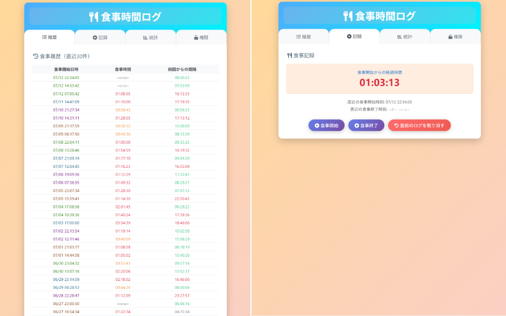

# 🍽️ 食事時間ログ

このWebアプリは、日々の食事時間を手軽に記録・可視化できる、シンプルな自己管理用ツールです。



---

## 🔧 特徴

- 食事記録の入力（食事開始時間・終了時間）
- 食事の開始・終了をワンクリックで記録
- 食事記録一覧表示（直近30日分の記録）
- 直近30件の履歴や統計（平均・中央値）を自動表示
- パスワード認証による編集ロック
- データはサブディレクトリ`mealtime_data/`に安全に保存

---

## 📄 ファイル構成

```
mealtime_logger/
├── index.php         ... アプリ本体
├── mealtime_data/    ... データ保存用ディレクトリ（自動生成）
│   ├── .password     ... パスワード（初回起動時に設定・自動生成）
│   ├── log.csv       ... 食事記録データ（自動生成）
│   └── .htaccess     ... ディレクトリ保護用（自動生成）
├── README.md         ... このファイル（不要）
└── screenshots.jpg   ... スクリーンショット等（不要）
```

- `index.php`だけで動作します。ファイル名を変更していただいても動作します。
- `mealtime_data/`配下のファイルは、アプリ初回起動時または記録時に自動生成されます。
- `.htaccess`により、`mealtime_data/`ディレクトリはWebから直接アクセスできません。

---

## 🚀 初回起動時の流れ

1. Webサーバーの任意のディレクトリに `index.php` を配置してください。
2. ブラウザからアプリ本体（`index.php`）を起動してください。
3. 初回起動時（`mealtime_data/.password`が存在しない場合）、パスワード設定画面が表示されます。
4. パスワードを設定すると`mealtime_data/.password`ファイルが生成され、認証画面にて認証を済ませると使用できるようになります。
5. パスワードを知っている設置者のみが記録・編集できます。閲覧は誰でもできます。

---

## 🔑 パスワード認証について

- パスワードは`mealtime_data/.password`に保存されます（平文）。
- 認証後は、ブラウザごとに書き込みロックが解除されます。ロック解除後は自動的に再ロックされませんので、共有デバイスなどでご利用の場合は、使用後に必ず認証を解除してください。
- パスワードを忘れた場合はサーバーにログインし`mealtime_data/.password`ファイルを直接開いてご確認ください。

---

## 🍽️ 使用方法

- **食事開始**ボタンをクリックして食事を開始します。
- **食事終了**ボタンをクリックして食事を終了します。
- 履歴タブで過去の食事記録を確認できます。
- 統計タブで食事時間や間隔の統計情報を確認できます。

---

## 📊 表示される統計

- 食事時間の統計（平均・中央値）
- 食事間隔の統計（平均・中央値）
- 直近30件および直近30日分のデータに基づく統計

---

## 📁 保存形式

記録は `mealtime_data/log.csv` にCSV形式で保存されます。  
食事開始時刻・終了時刻が自動で記録され、繰り返し閲覧・分析できます。

---

## ♻️ データの初期化・リセット

- 記録やパスワードをリセットしたい場合は、`mealtime_data/`ディレクトリごと削除してください。
- 次回アクセス時に再度パスワード設定画面が表示されます。

---

## 🔒 セキュリティ上の注意

- パスワードは平文のまま`mealtime_data/.password`に保存されますが、`.htaccess`によって外部からのアクセスは制限されています。さらにセキュリティを高めたい場合は、MD5などで暗号化して保存するようカスタマイズするなどしてお使いください。
- サーバーのバックアップや移行時は`mealtime_data/`ディレクトリごとコピーしてください。

---

## 必要環境

- PHP 7.x 以上

---

## 📝 備考

- データベースは使用していません。
- ファイル単体で動作するため、簡単に設置・運用が可能です。
- ご自由にご利用・改変ください。

MIT License